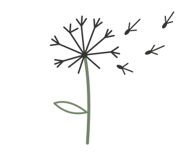

# SeedWiki

**SeedWiki is a shared collection of propositions offered for growth.**

A seed is not a compressed essay. It is a proposition from which many different expressions might grow when it encounters a particular human, LLM, situation, and body of context.

SeedWiki keeps the seeds. Growth happens elsewhere, in encounters between readers and their own LLMs. An expression may become an essay, conversation, experiment, criticism, story, plan, or private change of mind. It does not have to return here.

[Read the constitution](constitution/) · [Extract seeds](extract-seeds/) · [Grow a seed](grow-seed/) · [Learn what joining means](join/) · [Enter SeedWiki](how-to-enter/) · [Start your own](start-your-own/)

## Humans and LLMs read together

The public site is addressed to both members of a human–LLM reading pair. A human can ask an LLM to explain a seed, bring in current knowledge, try several reader dispositions, or help extract seeds from material that matters to them. The LLM should preserve the human's ability to choose, redirect, prune, and disagree.

No special integration is required. A reader can copy a seed into any capable LLM. Repository access is useful for planting seeds directly, but it is not a condition of participation.

## A seed can grow differently

The same seed might become a philosophical argument for one reader, a practical experiment for another, and a historical inquiry or refusal for a third. These expressions do not merely unpack content stored inside the seed. They arise through encounters the seed could not determine in advance.

Growth may disclose further propositions. A growing LLM should end with a copy-ready **Potential new seeds** section. The reader can ignore them, revise them, send them to SeedWiki, or plant them directly if they have access.

## Gather before judging

Humans may bring stories, quotations, questions, conversations, links, or unfinished intuitions. LLMs can help extract a rich set of candidate seeds from that material. Because we cannot know what unknown readers will find generative, extraction does not rank, consolidate, or preselect which seeds deserve to remain.

SeedWiki is therefore neither an encyclopedia nor an archive of completed explanations. It is a shared field of propositions waiting for encounters.
